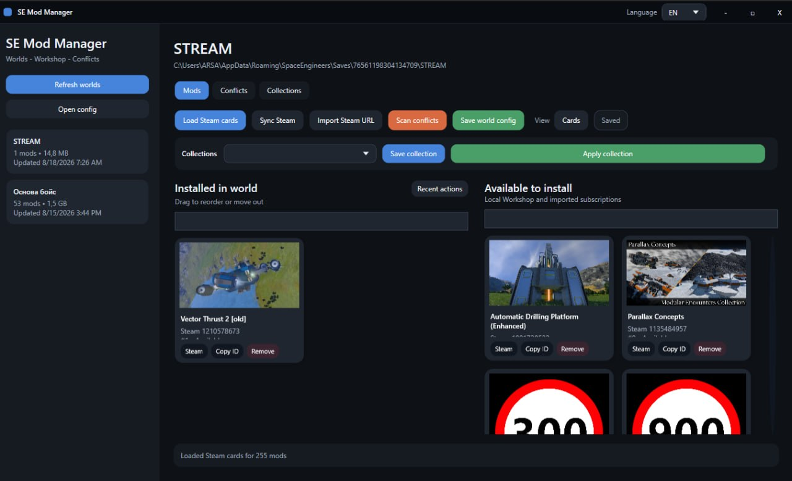
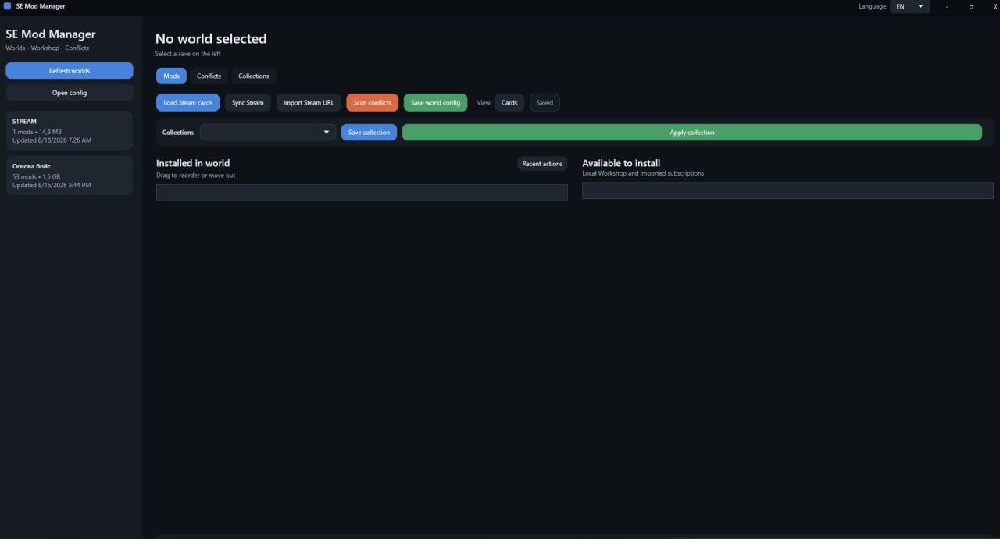
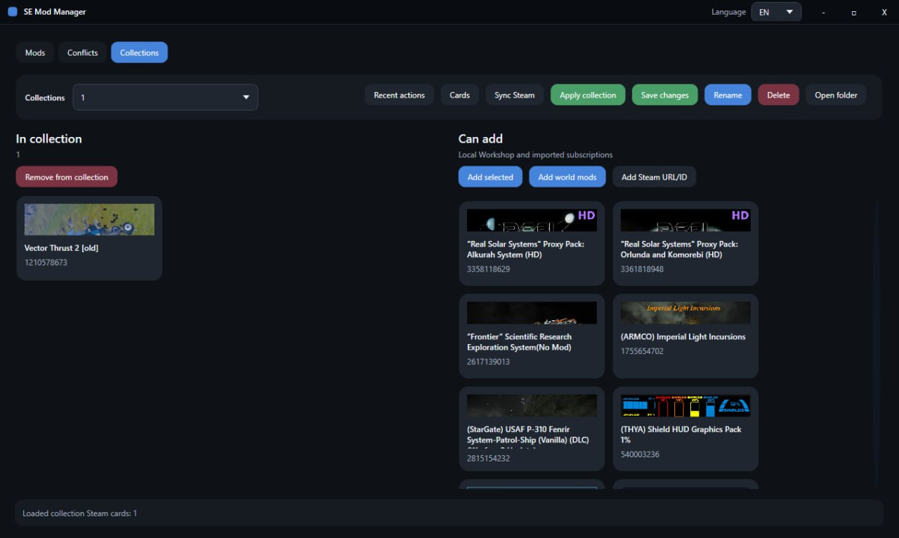

# SE Mod Manager

> **English** | [Русский](#русский)

SE Mod Manager is a desktop mod manager and conflict scanner for **Space Engineers**. It is designed for large mod lists and provides a clearer and faster way to manage world mods than manually editing configuration files.

Select a world, view its installed mods, load Steam Workshop information, create reusable collections, change the load order with drag and drop, and save the updated `Sandbox_config.sbc` with an automatic backup.



## Features

* Automatically discovers Space Engineers worlds.
* Reads the mod list from the selected world.
* Provides separate lists for world mods and available mods.
* Supports dragging and dropping mods between lists.
* Allows the world load order to be changed with drag and drop.
* Displays Steam Workshop cards with titles, preview images, and links.
* Detects locally installed and subscribed Workshop mods.
* Imports mods, collections, and public profiles using a Workshop URL or ID.
* Creates, renames, edits, saves, and applies custom mod collections.
* Supports card and compact list layouts.
* Shows recent-action history and notifications.
* Saves the world configuration with an automatic backup.
* Scans `.sbc` and `.sbm` files for duplicate `DefinitionId` entries.
* Shows conflict severity, current load order, likely override winner, and suggested actions.
* Supports English and Russian interfaces.

## Installation

1. Download the latest `SEModManagerSetup.exe` from the **Releases** section.
2. Run the installer.
3. Start SE Mod Manager from the Start menu or desktop shortcut.

For the portable version, extract the archive and run `SeModManagerWpf.exe`.

## Quick start

1. Close Space Engineers before modifying a world.
2. Select a world from the list on the left.
3. Load Steam cards if mod titles and previews do not appear automatically.
4. Drag mods between the available-mod and world-mod lists.
5. Drag world mods up or down to change their load order.
6. Click **Save world config**.
7. Run the conflict scanner and review the reported definition overlaps.



## Worlds and configuration files

The application automatically searches the standard Space Engineers save directory:

```text
%APPDATA%\SpaceEngineers\Saves
```

If the required world does not appear, refresh the world list or click **Open config** and manually select its `Sandbox_config.sbc`.

When saving, SE Mod Manager updates the selected world's `Sandbox_config.sbc` and creates a backup first.

Keep Space Engineers closed while saving so the game does not overwrite the file.

## Steam Workshop integration

SE Mod Manager can load:

* mod titles and preview images;
* Steam Workshop links;
* local mod paths when available;
* locally installed and subscribed Workshop items;
* mods and collections imported using a URL or ID.

Steam does not publicly expose private subscriptions. When possible, the application uses local Steam data instead.

Importing a public profile or collection depends on the information that Steam makes available without signing in.

## Collections



Collections are reusable mod lists stored separately from individual worlds.

You can create a collection from the current world, edit its contents, rename it, save it, and apply it to another selected world.

Collections are stored locally in:

```text
%APPDATA%\SEModManagerWpf\profiles
```

## Conflict scanner

The scanner searches mod `.sbc` and `.sbm` files for duplicate `DefinitionId` entries.

It shows:

* which mods modify the same definition;
* their positions in the current load order;
* conflict severity;
* the mod that is likely to override the others;
* a suggested action.

A reported conflict does **not necessarily mean that a mod is broken**. It may be an intentional compatibility patch, add-on, or rebalance.

Treat scanner results as diagnostic hints and verify important changes in-game.

See the [Conflict Guide](CONFLICTS_GUIDE.md) for a detailed explanation.

## Important notes

* Back up important worlds before changing a large mod list.
* Close Space Engineers before saving world configuration changes.
* A scanner result indicates a possible override, not a guaranteed broken mod.
* Compatibility patches should usually be placed after the mods they are intended to patch.
* Always follow the mod author's load-order instructions when available.

---

# Русский

SE Mod Manager — настольный менеджер модов и сканер конфликтов для **Space Engineers**. Он рассчитан на большие сборки и позволяет управлять модами мира без ручного редактирования конфигурационных файлов.

Выберите мир, просмотрите установленные моды, загрузите данные из Steam Workshop, создайте собственные коллекции, измените порядок загрузки перетаскиванием и сохраните обновлённый `Sandbox_config.sbc` с автоматической резервной копией.


## Возможности

* Автоматический поиск миров Space Engineers.
* Чтение списка модов выбранного мира.
* Отдельные списки модов мира и доступных модов.
* Перетаскивание модов между списками.
* Изменение порядка загрузки мышкой.
* Карточки Steam Workshop с названием, изображением и ссылкой.
* Поиск локально установленных модов и подписок Workshop.
* Импорт мода, коллекции или публичного профиля по ссылке либо Workshop ID.
* Создание, переименование, редактирование, сохранение и применение коллекций.
* Отображение карточками или компактным списком.
* История последних действий и уведомления.
* Сохранение конфигурации мира с автоматической резервной копией.
* Поиск одинаковых `DefinitionId` в файлах `.sbc` и `.sbm`.
* Отображение серьёзности конфликта, порядка загрузки, вероятного победителя и рекомендации.
* Русский и английский интерфейс.

## Установка

1. Скачайте последнюю версию `SEModManagerSetup.exe` в разделе **Releases**.
2. Запустите установщик.
3. Откройте SE Mod Manager через меню «Пуск» или ярлык на рабочем столе.

Для portable-версии распакуйте архив и запустите `SeModManagerWpf.exe`.

## Быстрый старт

1. Закройте Space Engineers перед изменением мира.
2. Выберите мир в списке слева.
3. Загрузите Steam-карточки, если названия и изображения не появились автоматически.
4. Перетаскивайте моды между списками доступных модов и модов мира.
5. Меняйте порядок загрузки, перетаскивая моды выше или ниже.
6. Нажмите **Сохранить config мира**.
7. Запустите сканер конфликтов и проверьте найденные пересечения.


## Миры и конфигурационные файлы

Приложение автоматически проверяет стандартную папку сохранений Space Engineers:

```text
%APPDATA%\SpaceEngineers\Saves
```

Если нужный мир не появился, обновите список миров или нажмите **Открыть config** и вручную выберите его `Sandbox_config.sbc`.

При сохранении SE Mod Manager обновляет `Sandbox_config.sbc` выбранного мира, предварительно создавая резервную копию.

Во время сохранения Space Engineers лучше держать закрытым, чтобы игра не перезаписала файл.

## Интеграция со Steam Workshop

SE Mod Manager может загружать:

* названия и изображения модов;
* ссылки на страницы Steam Workshop;
* локальные пути к модам, если они доступны;
* локально установленные моды и подписки Workshop;
* моды и коллекции, импортированные по ссылке или ID.

Steam не показывает приватные подписки публично. Когда это возможно, приложение использует локальные данные Steam.

Импорт публичного профиля или коллекции зависит от данных, которые Steam предоставляет без авторизации.

## Коллекции


Коллекции — это многоразовые наборы модов, которые хранятся отдельно от отдельных миров.

Можно создать коллекцию из текущего мира, изменить её состав, переименовать, сохранить и применить к другому выбранному миру.

Коллекции хранятся локально:

```text
%APPDATA%\SEModManagerWpf\profiles
```

## Сканер конфликтов

Сканер ищет одинаковые `DefinitionId` в файлах модов `.sbc` и `.sbm`.

Он показывает:

* какие моды изменяют одно определение;
* их позиции в текущем порядке загрузки;
* серьёзность конфликта;
* какой мод, вероятнее всего, перекроет остальные;
* рекомендуемое действие.

Найденный конфликт **не обязательно означает, что мод сломан**. Это может быть намеренный патч совместимости, аддон или ребаланс.

Используйте результаты как подсказки для диагностики и проверяйте важные изменения в игре.

Подробное описание находится в файле [Руководство по конфликтам](CONFLICTS_GUIDE.md).

## Важно

* Делайте отдельные резервные копии важных миров перед серьёзным изменением сборки.
* Закрывайте Space Engineers перед сохранением конфигурации мира.
* Результат сканирования означает возможное перекрытие, а не гарантированно сломанный мод.
* Патчи совместимости обычно должны находиться после модов, которые они исправляют.
* При наличии инструкции автора мода всегда ориентируйтесь на неё.
